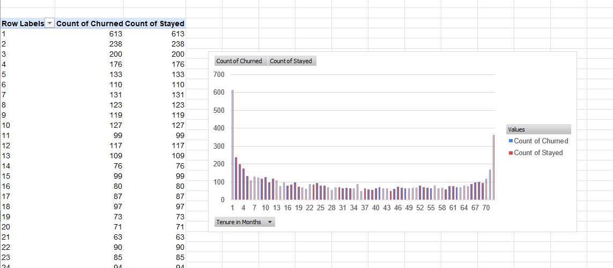

# Customer Churn Analysis – Telecom Company 

## Project Overview
This project analyzes customer churn for a fictional telecommunications company to identify key factors associated with customer cancellations and revenue loss. The analysis focuses on understanding how contract types, promotional offers, service add-ons, customer tenure, and churn reasons impact customer retention.

**Goal:** Generate actionable, data-driven insights to support customer retention strategies.

---

## Business Problem
Customer churn is a major challenge for telecommunications companies, as retaining existing customers is significantly more cost-effective than acquiring new ones.

**Objectives:**
* Identify high-risk customer segments.
* Understand main drivers of churn.
* Evaluate the financial impact of cancellations.

---

## Dataset Description
* **Total records:** 7,044 customers.
* **Scope:** Customer activity during a single fiscal quarter.
* **Key Features:** Demographics, Contract/Billing info, Service usage, Revenue metrics, Churn status.

---

## Analysis Steps & Insights

### 1. Tenure vs. Churn Behavior
We analyzed the relationship between how long a customer stays and their likelihood to churn.
* **Insight:** Customers on month-to-month contracts have the highest churn volume.
* **Insight:** Newer customers are at the highest risk.

### 2. Revenue Loss Analysis
* **Insight:** Most revenue loss comes from month-to-month customers.
* **Insight:** Competitor offers are a primary reason for churn.

### 3. Service & Monthly Charges
* **Insight:** Customers without online security are significantly more likely to churn.

---

## Business Recommendations
1.  **Contract Strategy:** Encourage customers to move from month-to-month to longer-term contracts using targeted incentives.
2.  **Targeted Offers:** Improve promotional strategies for high-risk segments (especially new customers).
3.  **Value-Add:** Promote **Online Security** and support services as key retention tools.
4.  **Competitive Watch:** Monitor competitor pricing and device offerings to proactively reduce churn reasons.

---

## Tools Used
* Microsoft Excel
* Pivot Tables
* Data Visualization
* Business Analytics

---
*Created by [Abdelrahman Diaa ]*
